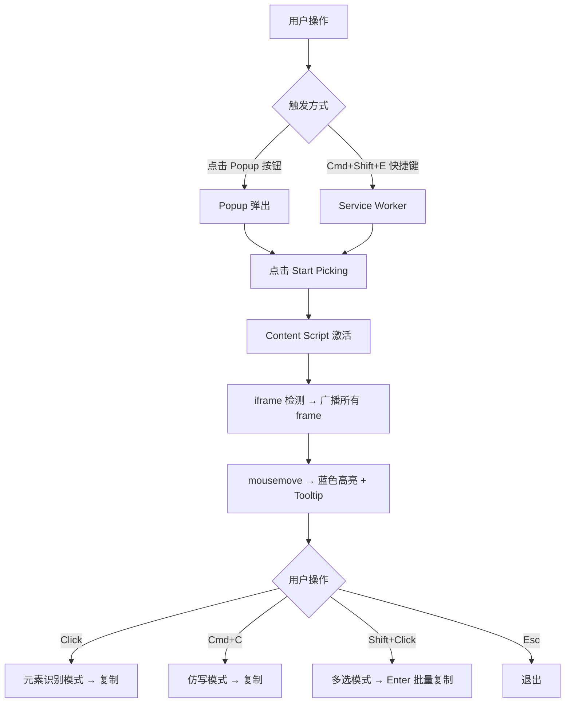
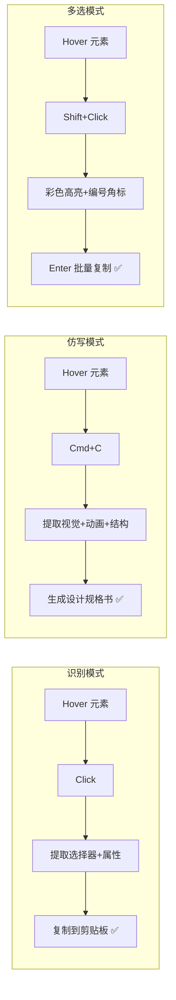
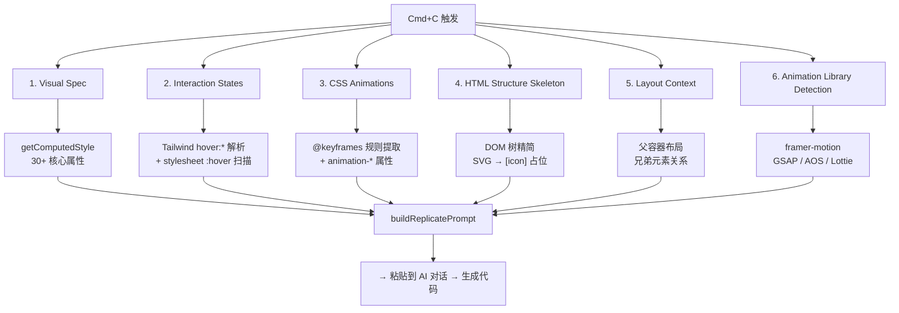
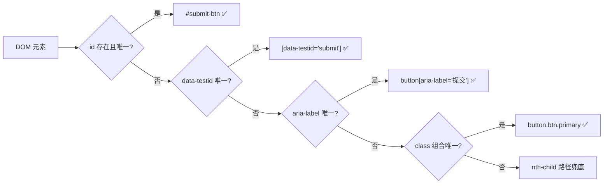
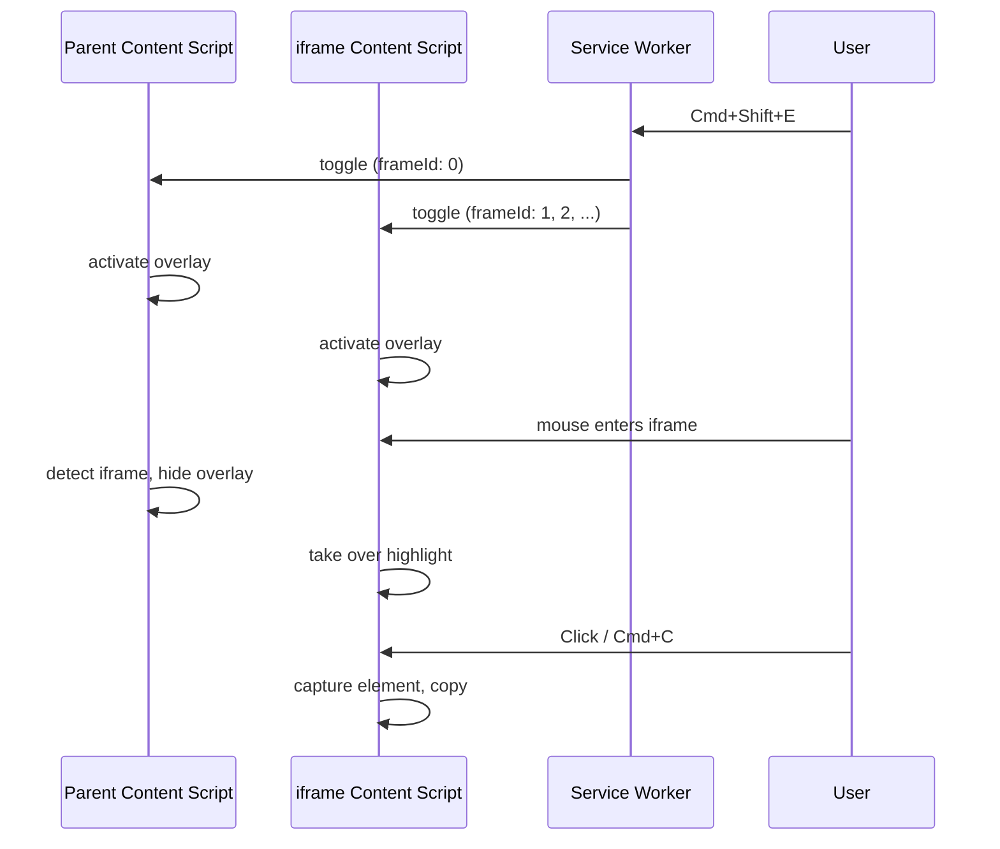

# EasyTalk AI 架构文档

## 1. 整体数据流

## 2. 三种操作模式

## 3. 仿写模式的 6 层数据提取

## 4. 选择器引擎优先级

## 5. iframe 通信架构

## 6. 文件职责矩阵

| 文件 | 职责 | 大小 |
|------|------|------|
| `content/content.js` | 核心：高亮/捕获/复制/仿写/多选 | ~36KB |
| `content/content.css` | 注入样式：overlay/tooltip/toast/badge | ~5KB |
| `utils/selector.js` | 智能 CSS 选择器引擎 | ~5KB |
| `background/service-worker.js` | 快捷键 + 跨 frame 广播 | ~3KB |
| `popup/popup.html` | 弹出窗口 UI | ~2KB |
| `popup/popup.css` | 弹出窗口样式 | ~4KB |
| `popup/popup.js` | 弹出窗口逻辑 | ~5KB |
| `manifest.json` | 扩展声明 | ~1KB |

## 7. 关键技术决策

| 决策 | 原因 |
|------|------|
| ES5 / 无构建 | 免编译，直接加载到 Chrome |
| all_frames 注入 | 解决 iframe 内元素无法识别 |
| execCommand + Clipboard API 双轨 | 兼容 Permissions-Policy 限制 |
| 选择器优先级链 | id → testid → aria-label → class → path |
| 仿写离线 | 不依赖 API key，粘贴到任何 AI 都能用 |
| 空 then/catch 吞 Clipboard 错误 | 避免控制台红线污染 |
